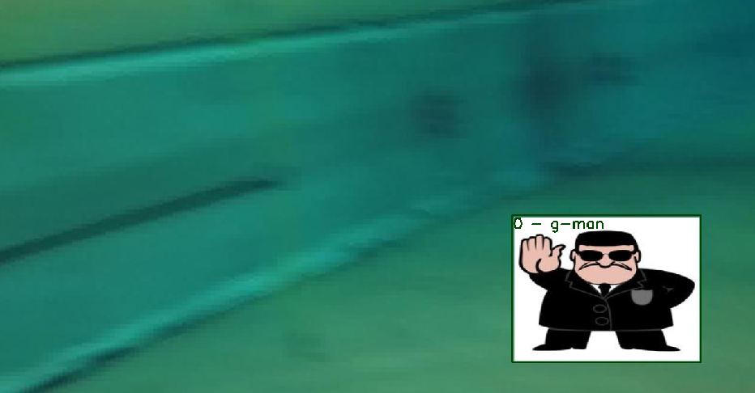
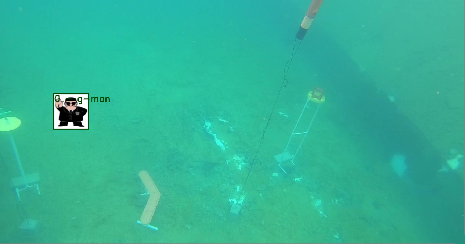
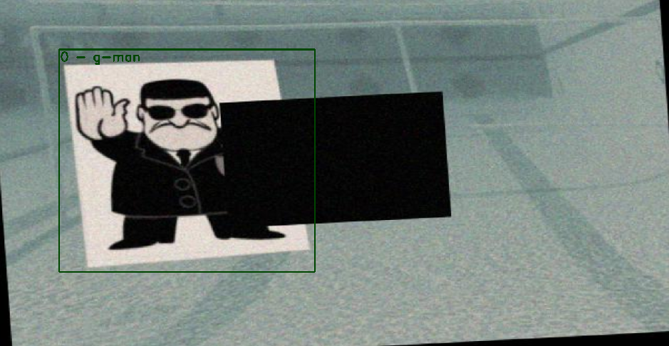
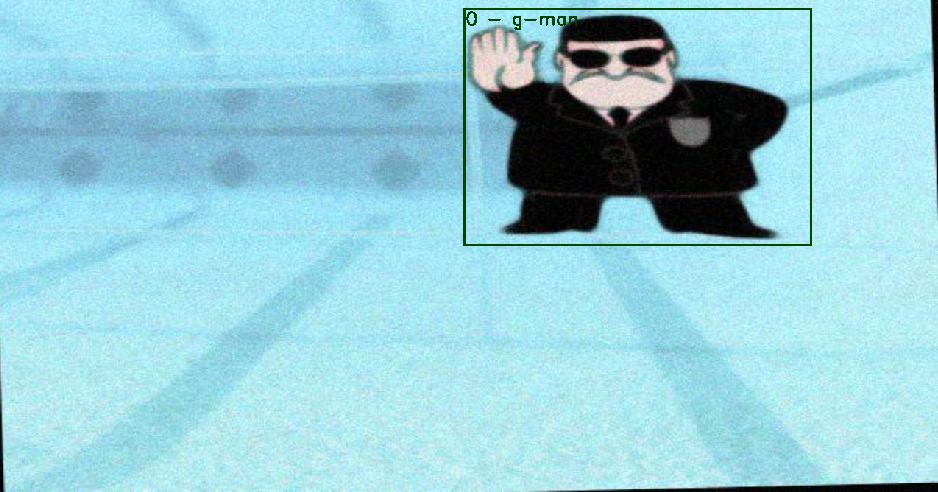

# DatasetCreator
This repository contains two scripts for dataset creation and augmentation, with automatic labeling in the YOLOv3 format. There are two different scripts, one for dataset creation, which pastes a randomly resized and randomly placed image into  backgrounds and saves the result, and one for dataset augmentations, which applies a range of augmentations on a specified set of images and saves the result.

## INSTALLATION
1. Clone repository into desired directory:
```console
$ git clone https://github.com/siljesu/DatasetCreator.git
```
2. Install following requirements:
six,
numpy>=1.15,
scipy,
Pillow,
matplotlib,
scikit-image>=0.14.2,
opencv-python-headless,
imageio<=2.6.1; python_version<'3.5',
imageio; python_version>='3.5',
Shapely, 
glob, 
pathlib, 
```console
$ sudo pip install six numpy scipy Pillow matplotlib scikit-image opencv-python-headless imageio Shapely glob pathlib
```
if your versions are not correct, fix this by explicitly specifying the version and forcing install:
```console
$ sudo pip install --force-reinstall 'numpy>=1.15'
```

## USAGE

### For datasetCreator:
1. Put your target objects, which need to be .png images, into "subjectImages" folder. Make sure the image filenames contain their corresponding label (for YOLOv3) as the first character. Example: 0.png, 0 (copy).png, 00.png will all have the same class 0.
2. Put desired backgrounds into "backgrounds" folder, these should be .jpg and should be larger than all the subject images. If this is not possible, then adjust the scaling parameters inside the script to fix this problem.
3. open script to modify:
   - scaling parameters. These specify the largest and smallest random scaling of target image allowed.
   - whether to preview images
   - amount sets of images desired.
4. Run script, created files, including label files, will be saved to "createdImages" folder.





### For datasetAugmentor_single:
1. Open script to modify:
   - path to images to be augmented, these should contain one labeled object per image, and should be .jpgs with corresponding .txt files. Labels need to be in the YOLOv3 format, which is: bb_class   bb_x_center   bb_y_center   bb_width   bb_height. The output of datasetCreator is already in this format.
   - The batch name and multiples of the original images you want to create.
   - To view n preview images
   - The sequential of augmentations you wish to apply. Some augmentations are heavy and will sometimes, combined with too many other things, cause this script to be unable to finish. Usually this is not the case, but please be aware of this. Do not go too crazy with the amount of augmentations at once.
2. Run script; created files will be saved to "augmented" folder.


### For datasetAugmentor_multiple:
1. Open script to modify:
   - path to images to be augmented, these can contain several labeled objects per image, and should be .jpgs with corresponding .txt files. Labels need to be in the YOLOv3 format, which is: bb_class   bb_x_center   bb_y_center   bb_width   bb_height. The output of datasetCreator is already in this format.
   - The batch name and multiples of the original images you want to create.
   - To view n preview images
   - The list of sequentials (augmentations) you wish to apply. Some augmentations are heavy and will sometimes, combined with too many other things, cause this script to be unable to finish. Usually this is not the case, but please be aware of this. Do not go too crazy with the amount of augmentations at once.
2. Run script; created files will be saved to "augmented" folder, with each sequential numbered as "batch1", "batch2" and so on.





